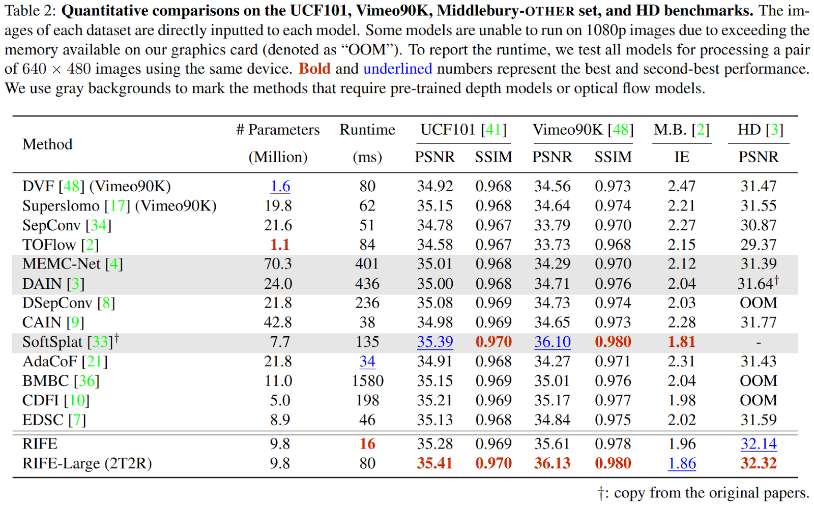

# Frame Rate Enhancer

AI can enhance video frame rates by generating new frames between existing ones. This is done using deep learning algorithms such as video frame interpolation (VFI) and video super-resolution (VSR). Recent studies have proposed efficient methods for this, such as a one-stage space-time video super-resolution framework that can reconstruct high-resolution slow-motion video from low-resolution and low-frame-rate video. While the quality of interpolation is often reduced due to large object motion or occlusion, recent studies have proposed methods to address this, such as a video frame interpolation method that explicitly detects occlusion by exploring depth information. The accuracy of AI-based video frame interpolation models depends on several factors, but here is a list of popular and effective models. However, here is a list of the models based on their popularity and general effectiveness:

* DVF (Deep Voxel Flow)
* DAIN (Depth-Aware Video Frame Interpolation)
* RIFE (Real-Time Intermediate Flow Estimation)
* Super SloMo
* RAFT (Recurrent All-Pairs Field Transforms)
* TecoGAN (Temporally Coherent GAN)
* EDVR (Enhanced Deep Video Restoration)
* CAIN (Content-Aware Inpainting Network)
* MEMC-Net (Motion Estimation and Motion Compensation Network)
* SepConv (Separable Convolutional Networks)
* Softmax Splatting (SS)
* TOFlow (Task-Oriented Flow)

In summary, video frame rate enhancement by artificial intelligence is a promising technique that can generate new frames in between existing frames of a video, resulting in a higher frame rate and smoother motion. There are several approaches to video frame rate enhancement using AI, including video frame interpolation (VFI) and video super-resolution (VSR). These approaches use deep learning algorithms to improve the quality of video frames and can be applied to various applications, such as face detection and recognition and image and video quality enhancement.

As we can see, RIFE is relatively better than others. It has an excellent Peak signal-to-noise ratio (PSNR) and Structural Similarity Index Measure (SSIM). RIFE (Real-Time Intermediate Flow Estimation) is a video frame interpolation algorithm that uses a neural network to directly estimate intermediate flows from coarse to fine. This allows it to achieve much faster speeds than other methods. RIFE is a real-time algorithm that can process 720p videos at 30 frames per second. Additionally, RIFE is designed to directly estimate intermediate flows from coarse to fine, which can lead to better accuracy compared to other methods that first estimate bidirectional optical flows and then linearly combine them to approximate intermediate flows. According to the search results, RIFE is 4–27 times faster than the popular SuperSlomo and DAIN methods while producing better results. Additionally, RIFE is the first flow-based and real-time VFI algorithm that processes 720p videos at 30 frames per second. Therefore, RIFE is a faster and more efficient VFI algorithm than other methods. In conclusion, RIFE is a fast and accurate video frame interpolation algorithm that is suitable for real-time applications.

### Testing The Model
After using the RIFE Model, it enhances 5 FPS video to 20 FPS.

