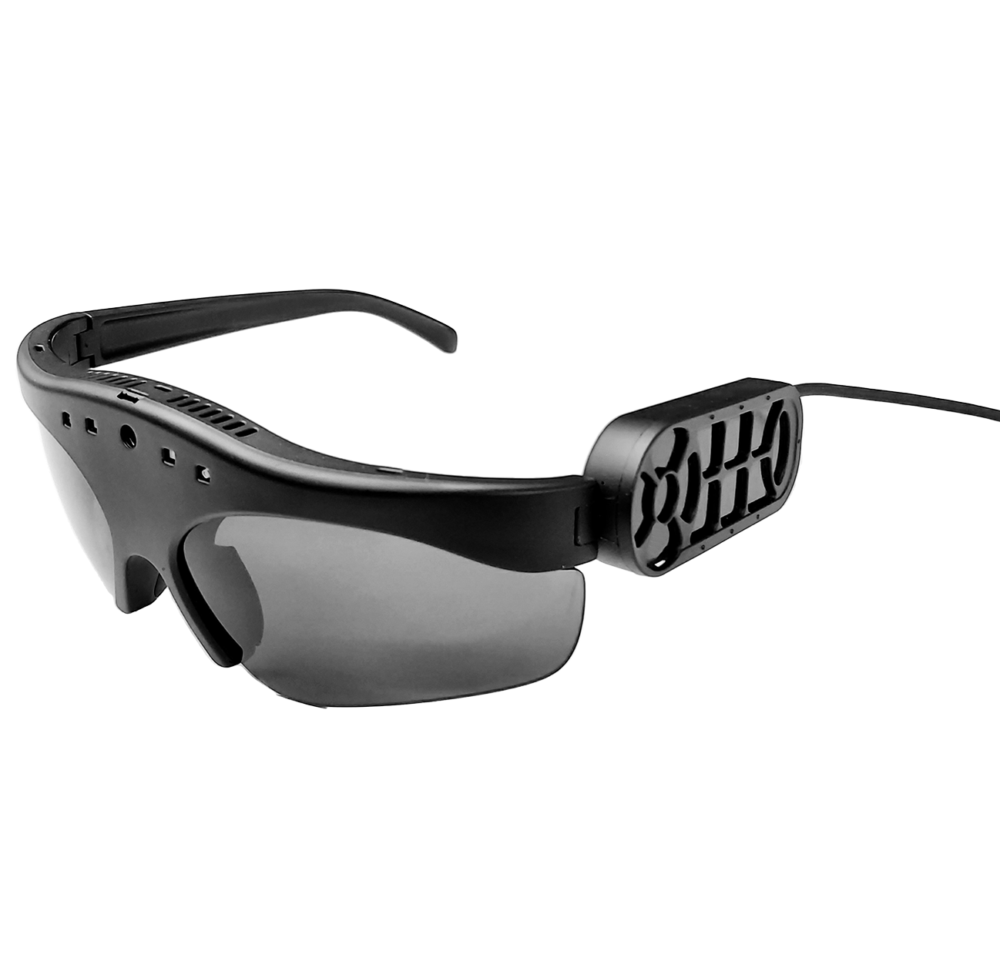

# Glass with Computer Vision
AI-powered smart glasses use artificial intelligence to describe objects and read text aloud, helping the visually impaired. Some also have facial recognition, which can be used to identify people the wearer knows or to scan for information about them. This technology has the potential to revolutionize the lives of people with visual impairments, giving them a greater degree of independence and allowing them to participate more fully in society. AI-powered smart glasses are a type of wearable technology that uses artificial intelligence to help people with visual impairments. The glasses have a built-in camera that can scan the environment and identify objects, which are then spoken aloud to the wearer. This allows people with visual impairments to navigate their surroundings more easily and independently. Some smart glasses also have facial recognition capabilities, which can be used to identify people the wearer knows or to scan for information about them. This can be helpful for people with visual impairments who want to stay connected with friends and family or who need to access information quickly and easily. AI-powered smart glasses are still in their initial stages of development, but they have the potential to revolutionize the lives of people with visual impairments. By providing them with greater independence and access to information, these glasses can help people with visual impairments live more fulfilling and productive lives.

There are several AI-powered smart glasses available, such as:
* Envision's smart glasses: It is an AI-powered smart glass for people with visual impairments, including:
  * Real-time text recognition: The glasses can capture text in documents or on packaging and convert it into audio for the wearer to hear.
  * Video calling: Envision Glasses enables video calling, allowing users to connect with others visually.
  * Scene description: The glasses can describe the scene to the wearer, providing information about their surroundings.
  * Object recognition: Envision Glasses can recognize and identify objects, making it easier for users to interact with their environment.
  * Light detection: The glasses can detect changes in light levels, helping users navigate different lighting conditions.
  * Currency recognition: Envision Glasses can recognize and identify different currencies, assisting users in handling money.
  * Color detection: The glasses can detect and describe colors, providing color information to the wearer.
  * Facial recognition: Envision glasses have facial recognition capabilities, allowing users to recognize and interact with people.
  * Hands-free and unobtrusive experience: The glasses provide a hands-free and unobtrusive way for users to access the visual world.
  * Comfortable and lightweight design: Envision Glasses are designed to be worn all day with a comfortable and lightweight profile.
* Amal Glass: It is a smart glass device designed for individuals with visual impairments. The following are some of its features:
  * Artificial intelligence: Amal Glass is based on artificial intelligence and uses machine learning to provide real-time audio cues to the wearer.
  * Camera and sensors: The glasses contain a camera and sensors that capture images and data from the environment.
  * Mobile application: Amal Glassworks provides a mobile application that connects to the glasses and provides additional functionality.
  * Multilingual support: The glasses support Arabic and English, with plans to add Spanish, French, and other languages in the future.
  * Virtual assistant: Amal Glass provides a virtual assistant that enables wearers to know more about their surrounding environment.
  * Prayer times: The glasses can announce prayer times for Muslims.
  * Qibla's position: The glasses can help Muslims find the direction of the Qibla.
  * People recognition: The glasses can recognize and identify people, making it easier for users to interact with others.
  * Flashlight: The glasses have a built-in flashlight that can be used in low-light conditions.
  * Weather: The glasses can provide real-time weather information.
  * Address: The glasses can provide address information.
  * TV remote control: The glasses can be used as a TV remote control.
  * Barcode and QR code reader: The glasses can read barcodes and QR codes.
  * System language settings: The glasses allow users to change the system language settings.
* NuEyes Pro: It is a smart glasses device designed for individuals with visual impairments. Some of its features include:
  * Hands-free magnification: NuEyes Pro provides hands-free magnification of up to 12x, making it easier for users to see objects and text.
  * OCR: The glasses have OCR (optical character recognition) capabilities, allowing them to recognize and read out printed text.
  * Lightweight: NuEyes Pro is lightweight and comfortable to wear.
  * Focus settings: The glasses have four focus settings, making it easier for users to adjust the magnification to their needs.
  * Color modes: NuEyes Pro has six color modes, allowing users to adjust the colors and contrast of what they are looking at.
  * Live view in full color: The glasses provide a live view in full color, making it easier for users to see their surroundings.
  * Bar/QR code scanning: NuEyes Pro can scan barcodes and QR codes.
  * Voice commands: The glasses can be operated using simple voice commands.
  * Samsung Galaxy S phone: NuEyes Pro comes with a Samsung Galaxy S phone and charger.
  * Patented low-vision software: The glasses come with patented low-vision software.
* AIRA: It is a service that helps blind and visually impaired individuals navigate their surroundings with the assistance of live sighted guides. The service utilizes smart glasses or a phone camera to provide real-time video streaming to trained Aira agents. Here are some features of Aira:
  * Live video streaming: Aira connects users with sighted guides who use the live video stream from the smart glasses or phone camera to assist them in real time.
  * Smart glasses and MiFi unit: When signing up with Aira, users receive a pair of smart glasses and a small MiFi unit, which acts as a personal hotspot. The smart glasses integrate a 120-degree wide-angle camera to provide a fuller picture of the user's surroundings.
  * AT&T network: Aira utilizes the AT&T network for connectivity.
  * Instant access to information: With Aira, users have instant access to information and assistance, allowing them to navigate their surroundings more effectively.
  * Remote assistance: Aira agents can provide guidance and assistance with tasks such as reading signs, identifying objects, navigating unfamiliar environments, and more.
  * Accessibility features: Aira's smart glasses and service are designed specifically for individuals who are blind or have low vision, providing them with greater independence and accessibility.