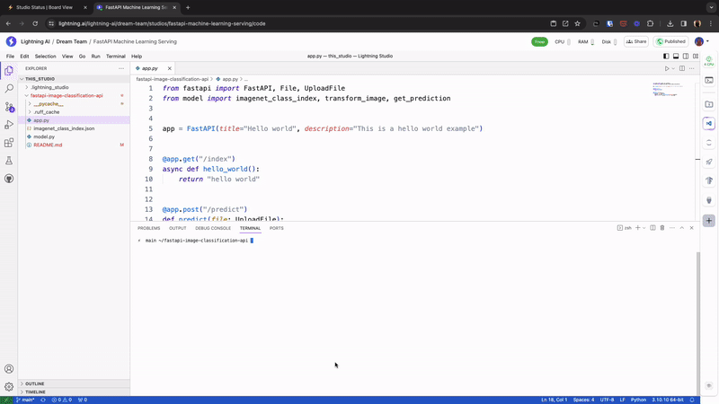

# Building Machine Learning API with FastAPI

In this Studio, we will learn how to deploy a Machine Learning API using FastAPI. We will deploy an image classification model with ResNet architecture on a CPU machine. You can run this Studio as a part of [free CPU quota](https://lightning.ai/pricing).

## TLDR; Run


```bash
cd fastapi-image-classification-api
uvicorn app:app
```

## What is FastAPI

FastAPI is a web framework for building and deploying RESTful APIs in Python. Once deployed, the API can be used by any frontend or backend via REST protocol.


**Create FastAPI Endpoint**

First, we import FastAPI class and create an object app. This class has useful parameters like we can pass the title and description for Swagger UI.

```py
from fastapi import FastAPI
app = FastAPI(title='Hello world', description='This is a hello world example', version='0.0.1')
```

We define a function and decorate it with `@app.get`. This means that our API /index supports the GET method. The function defined here is async, FastAPI automatically takes care of async and without async methods by creating a thread pool for the normal def functions and it uses an async event loop for async functions.

```py
@app.get('/index')
async def hello_world():
    return "hello world"
```

**Define Prediction API Endpoint**

We will create an API for image classification, we name it `predict`. We will use a pretrained model from `torchvision` library.

We create a `model.py` module which handles the model loading and image pre-processing logic. We define our endpoint in `app.py` as following - 

```py
@app.post("/predict")
def predict(file: UploadFile):
    img_bytes = file.file.read()
    class_id, class_name = get_prediction(image_bytes=img_bytes)
    return {"class_id": class_id, "class_name": class_name}

```

We can run this app as uvicorn server using the following command - 

```bash
cd fastapi-image-classification-api
uvicorn app:app
```
